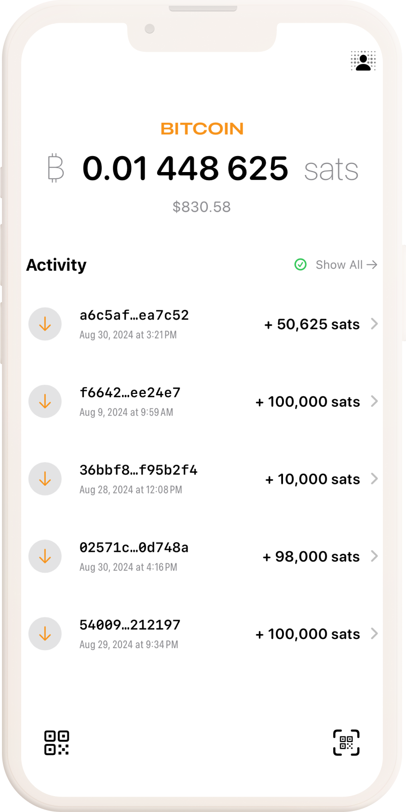

# BDK Swift Example Wallet

An example iOS app using [Bitcoin Dev Kit](https://github.com/bitcoindevkit) 1.0

## Build

### BDK 1.0

The `main` branch of BDK Swift Example Wallet uses a local package of bdk-swift, built using a [build script in bdk-ffi](https://github.com/bitcoindevkit/bdk-ffi/blob/master/bdk-swift/build-xcframework.sh).

*This is temporary as we gear up for the 1.0 beta of bdk-swift, which is currently in [alpha](https://github.com/bitcoindevkit/bdk-swift/releases), and allows for those migrating to 1.0 to keep up with the latest and greatest.*

### BDK Pre 1.0

The `pre-v1` branch of BDK Swift Example Wallet uses a remote package of bdk-swift.

## Functionality

*This is an experimental work in progress.*

Create a wallet, send and receive.

### Wallet

Defaults to single key HD wallets with BIP86 derivation paths. 

## Swift Packages

- [bdk-swift](https://github.com/bitcoindevkit/bdk-swift)

- [BitcoinUI](https://github.com/reez/BitcoinUI)

- [KeychainAccess](https://github.com/kishikawakatsumi/KeychainAccess)
