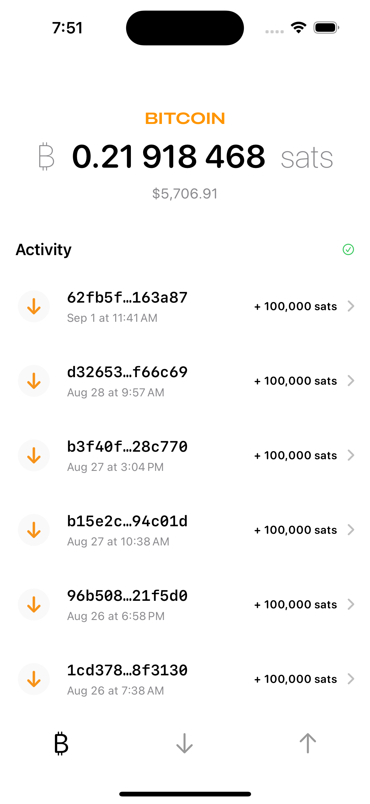

# BDKSwiftExampleWallet

An example iOS app using [Bitcoin Dev Kit](https://github.com/bitcoindevkit) (BDK) 1.0

## Functionality

*This is an experimental work in progress.*

### Wallet

Defaults to single key HD wallets with BIP86 derivation paths. 

### Implemented

Create a wallet, send and receive.

## Swift Packages

- [bdk-swift](https://github.com/bitcoindevkit/bdk-swift)

- [BitcoinUI](https://github.com/reez/BitcoinUI)

- [KeychainAccess](https://github.com/kishikawakatsumi/KeychainAccess)
