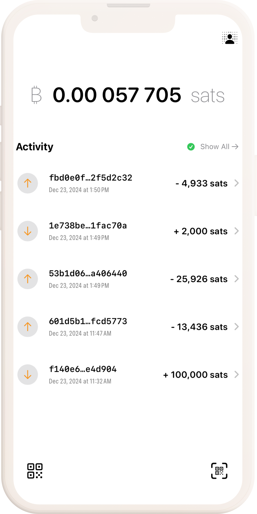

# BDK Swift Example Wallet

A native iOS app example using [Bitcoin Dev Kit](https://github.com/bitcoindevkit) via [language bindings](https://github.com/bitcoindevkit/bdk-ffi).

Download the app on [TestFlight](https://testflight.apple.com/join/A3nAuYvZ).

## Build

### BDK Version

The `main` branch of BDK Swift Example Wallet uses [bdk-swift](https://github.com/bitcoindevkit/bdk-swift) 2.0+.

Watch how to build a simple bitcoin iOS wallet with BDK on [YouTube](https://www.youtube.com/watch?v=M9AYugUF5uQ).

## Functionality

*This is an experimental work in progress and may contain both known and unknown bugs. This wallet is intended for testing and research purposes only, as such it is intended for test networks.*

Create a wallet, send and receive.

### Wallet

Defaults to single key HD wallets with BIP86 derivation paths. 

## Swift Packages

- [bdk-swift](https://github.com/bitcoindevkit/bdk-swift)

- [BitcoinUI](https://github.com/reez/BitcoinUI)

- [KeychainAccess](https://github.com/kishikawakatsumi/KeychainAccess)
